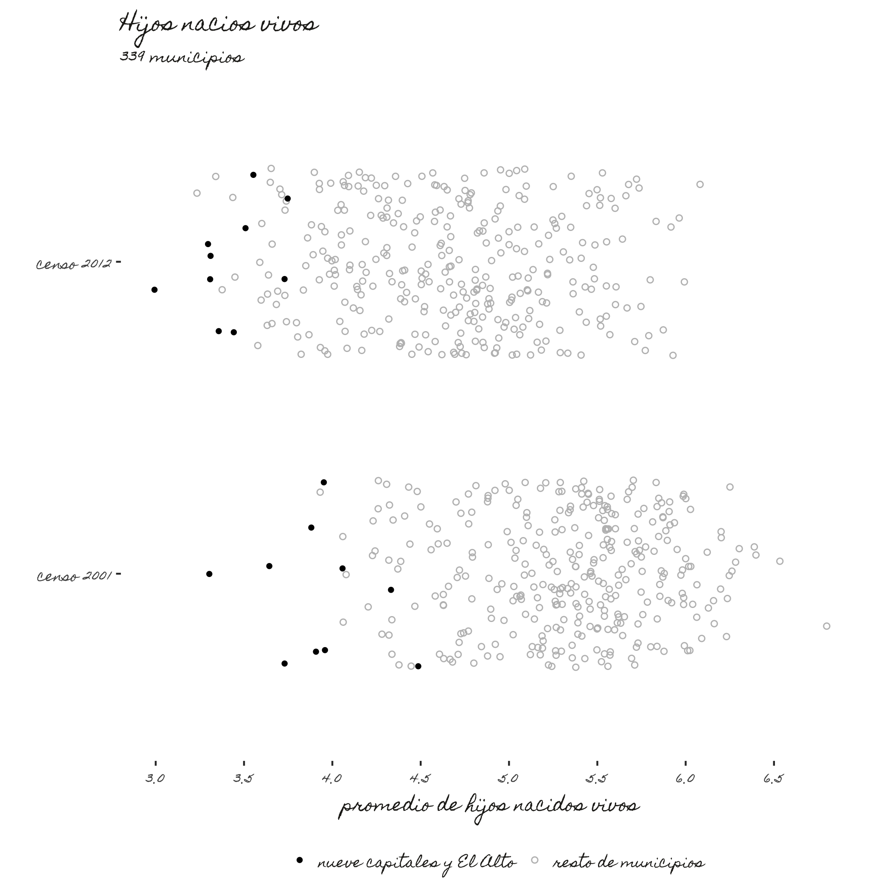
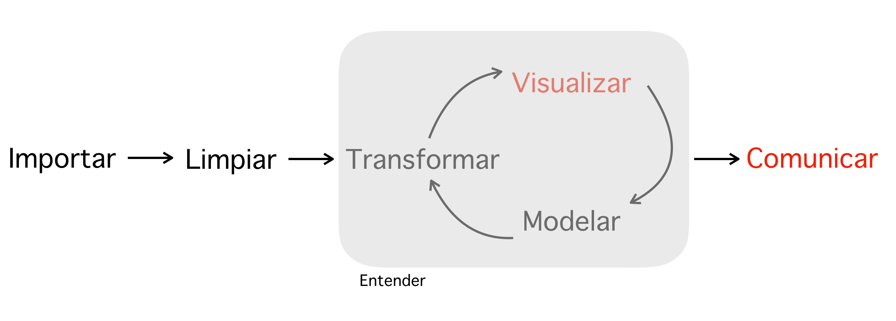

```{r, include=FALSE, echo=FALSE}
Sys.setlocale(locale = "es_ES.UTF-8")

pqkgs <- c("rio", "magrittr", "googleway", "dplyr", "plyr",  "repmis", "knitr", "rgdal", 
           "highcharter", "geojsonio", "spdplyr", "rmapshaper", "kableExtra", "knitr",
           "tidyverse", "ggmap", "kableExtra", "ggplot2", "nycflights13", "rtweet",
           "data360r", "rvest", "WDI")

lapply(pqkgs, function(x) require(x, character.only = TRUE))

# Citación automática
repmis::LoadandCite(pqkgs, file = 'packages.bib')
rm(pqkgs)
```

# Objetivo

Lograr narrar historias basadas en datos. El curso se dirige a estudiantes de la Carrea de Comunicación Social de la Universidad Católica Boliviana San Pablo.

# Plataformas para lograr el objetivo

La realización del curso se basa principalmente en **R** [-@CiteR], que es un lenguaje de programación con fines [estadísticos y de visualización](https://es.wikipedia.org/wiki/R_(lenguaje_de_programación)). R es software libre (sin costo) y está disponible para sistemas operativos Windows, Linux y OSx (Apple). La razón para utilizar R como herramienta principal se basa en su potencia y versatilidad así como su amplio uso en enseñanza de periodismo de datos y análisis de datos en programas de universidades como Massachussets Institute of Technology [MIT](https://micromasters.mit.edu/dedp/.) o [University of Texas Austin](https://journalismcourses.org/RC0818.html ) con su curso sobre periodismo de datos en R. 

Ahora bien, R tiene un amplio número de librerías (aplicativos) exclusivos para visualización de datos. Se propone utilizar los mas comunes comunes como **ggplot2** [-@R-ggplot2] y **highcharter** [-@R-highcharter]. ggplot2 produce gráficos estáticos . El siguiente gráfico, por ejemplo, fue creado en **ggplot2** y muestra el promedio de hijos nacidos vivos por municipio y por áreas urbanas y rurales en Bolivia. El procesamiento de datos fue también realizado en **R**.



Puede verse también en este tutorial de ggplot2 del Harvard Institute for Quantitative Social Science [@IQHarvard:P8pgxHpQ] como **R** es capaz de crear los gráficos que utiliza el periódico The Economist.

Por su parte, **highcharter** produce gráficos interactivos, en los que el usuario final puede manipular parcialmente la visualización. Por ejemplo, en el siguiente mapa se muestran 10 procesos electorales en los que participó el Movimiento al Socialismo. En él, puede ponerse en pausa la animación y/o seleccionar cada una de las categorías de votos.

<iframe frameBorder="0" src="graficos/mapa1.html" width="100%" height="800" allowtransparency="true"></iframe>

Si bien el énfasis estará en R para las visualizaciones, se utilizarán también las siguientes alternativas:

- [Data Wrapper](https://www.datawrapper.de)
- [Tableau](https://public.tableau.com/en-us/s/gallery)
-	[Plotly](https://plot.ly)
- [DIVE MIT Media Lab](https://dive.media.mit.edu)

Para visualizaciones geográficas que requieran, por ejemplo mapas de Google Maps o de [Open Street Maps](https://www.openstreetmap.org) también se tendrá a **R** como base y a las librerías **googleway** [-@R-googleway] para mapas de Google Maps interactivos y **ggmap** [-@R-ggmap] para mapas de Google Maps estáticos. Sobre este último sugiero revisar el texto académico que detalla la librería: [@Kahle:2013uv]    

Para el procesamiento de datos, se utilizará Excel, Google Spreadsheet y R, concretamente utilizando una nueva narrativa de programación, **Tidyverse**,  que facilita el lenguaje de forma considerable [@Rickert:2017vt].  

# Método para lograr el objetivo

Hay dos etapas para aprender a hacer análisis de datos con fines narrativos: 

-	Conocer la arquitectura práctica de una base de datos, teoría sobre análisis cuantitativo,  y estadística básica.

-	Saber  conseguir manipular  y visualizar datos.

Sin el paso 1, el 2 se hace endeble; es una secuencia y cada parte tiene detalles que se narran a continuación:

##	Conocer la arquitectura práctica de una base de datos, teoría sobre análisis cuantitativo,  y estadística básica.

Una base de datos es una reunión organizada de datos, por tanto se debe comprender que tipo de datos individuales hay: los átomos de una base de datos, los ladrillos que construyen una base. Por ejemplo en la siguiente base de datos de vuelos del aeropuerto de Nueva York [@R-nycflights13] para el año 2013 pueden identificarse diferentes tipos de variables: 

```{r echo=FALSE, warning=F,message=F}
b <- readr::read_csv("flights.es.csv")
```

```{r, echo=FALSE, include=T, warning=F}
head(b) %>%
  kable() %>%
  kable_styling(full_width = F)
```

Por ejemplo la columna de **hora_salida** es una columna numérica, la última columna es de tipo fecha/hora y la columna de **número_avión** es de tipo texto. Cada tipo de columna tiene varias implicaciones para el análisis estadístico; partiendo de que no es posible operar aritméticamente una variable de texto hasta que es posible hacer operaciones econométricas con variables numéricas. Es tambiém muy común que bases de datos construidas en **excel** sean posteriormente importadas con los tipos de columnas equivocados a un procesador de datos. Saber los tipos correctos ayuda, entonces, a corregir estos desperfectos. Un buen resumen del tipo de varibles puede encontrarse en el portal estadístico del gobierno australiano [@AustralianBureauofStatistics:n6r7ejht]. 

Así mismo, hay extensa teoría de cómo organizar una base de datos evitando problemas comunes [@Wickham:2014if], que se utilizarán para conocer cuáles son los parámetros para saber si una base de datos está limpia o no. 

Respecto a teoría de análisis cuantitativo y estadística básica, se utilizará básicamente estadística descriptiva y aspectos muy básicos de estadística inferencial. Esta parte se basará en el curso de Data Analysis for Social Scientist dictado en línea por el [MIT](https://www.edx.org/es/course/data-analysis-for-social-scientists-0). Se conocerá cómo elegir un representante para todo un grupo de datos, por ejemplo, el promedio o el dato que más se repite (moda). Asimismo, se conocerá como se desvían los datos de nuestra elección de representante.¿Cuán dispersos están los datos de nuestro representante?. Aquí se analizan herramientas como la desviación estándar.

Asimismo, se aprenderá  a relacionar  dos o más variables. Digamos por ejemplo que queremos saber el impacto del estudio sobre el crecimiento de un país. Para esto se utiliza estadística inferencial.

En síntesis: esta primera parte consiste en saber lo básico pero fundamental.

## Saber  conseguir manipular  y visualizar datos

La segunda parte puede resumirse en este gráfico [@wickham2016r]:


 

Importar implica saber buscar y/o saber descargar información de donde se sabe que hay datos. en En esta parte se enseñará:

-	A importar formatos de almacenamiento de datos, por ejemplo, archivos con extensión .csv. El formato determina la forma de descarga.

- Conocer como descargar bases de datos del internet:
    + De tablas de Wikipedia, por ejemplo. Para descagar bases de datos como [esta](https://es.wikipedia.org/wiki/Anexo:Pa%C3%ADses_por_orden_cronológico_según_su_independencia) existen métodos y librerías de **R** como **rvest** [-@R-rvest]
    + De twitter. Existen al menos dos librerías para poder descargar los tweets de un usuario y todas las características de los mismos, como por ejemplo, de que dispositivo móvil se ha emitido el tweet, a que hora, día, etc. Se enseñará a importar las bases de datos a partir de la librería **rtweet** [-@R-rtweet]. Puede verse [aquí un análisis de los tweets del Presidente Evo Morales](https://alex-roc.github.io/EvoTwitter/) como ejemplo. 
    + Del Banco Mundial. El Banco mundial ha producido dos libreríasa para R que permiten la descarga directa de todas sus bases de datos: **data360r** [-@R-data360r] y **WDI** [-@R-WDI] . [Aquí puede encontrarse un ejemplo](https://rafalopezv.io//data%20analysis/r/evocrecimiento/) de un análisis sobre crecimiento del Producto Interno Bruto en Latinoamérica utilizando una de estas librerías   

Asimismo, muchas veces se trabaja con varias bases de datos a la vez, entonces, se debe aprender a importar más de una base de datos al mismo tiempo.

Limpiar es la parte más delicada y morosa. Consiste en cumplir con el primer paso y lograr formatear una base de datos hasta que sea trabajable. En esta etapa son innumerables los problemas que pueden ocurrir y se orientará en solucionar los más típicos.[@deJonge:2013va] 

Transformar, modelar y visualizar no es otra cosa que convertir los datos que cumplan con el fin de la publicación. Por ejemplo, si es una base de datos de elecciones, probablemente sea más eficiente convertir los datos en porcentajes. La visualización en esta etapa es solo para conocer las características de los datos, no para presentar el resultado final

Comunicar es la mejor parte. Aquí las imágenes son muy valiosas y pueden ser, como se anticipó:

- Estáticas. Son las que vemos en cualquier periódico impreso
- Interactivas. Son las que vemos en internet y son reactivas. Son las que nos permiten interactuar con el gráfico. (como el mapa de Bolivia presentado previamente)
- Aplicaciones. Son aquellas en las que el usuario tiene mucho control sobre el gráfico. [Aquí un ejemplo](https://www.infobae.com/america/deportes/goles-mundial-rusia-2018/). Se enseñará nociones básicas de cómo crear aplicaciones y como publicarlas

Para la parte de comunicación se enseñará a crear una página web, como la que contiene esta propuesta.

# Tiempos

El curso está dividido en dos partes:

- Conocer la arquitectura práctica de una base de datos y teoría aplicada de estadística general

    + Estadística básica: 4 horas
    + El ABC de las bases de datos: 2 horas

- Saber  conseguir manipular  y visualizar datos

    +	Importar: 4 horas
    +	Limpiar: 5 horas
    +	Manipular: 3 horas
    +	Visualizar: 6 horas

# Sobre la propuesta

Esta propuesta se construyó íntegramente en **R** y varias de las librerías mencionadas.

[^1]: Centro virtual de eneseñanza de Ciencia de Datos 

# Referencias